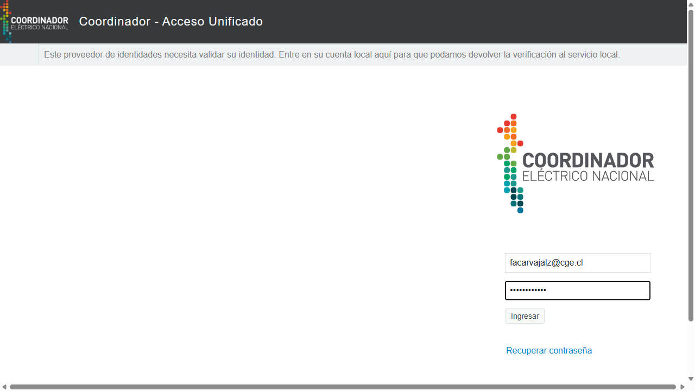
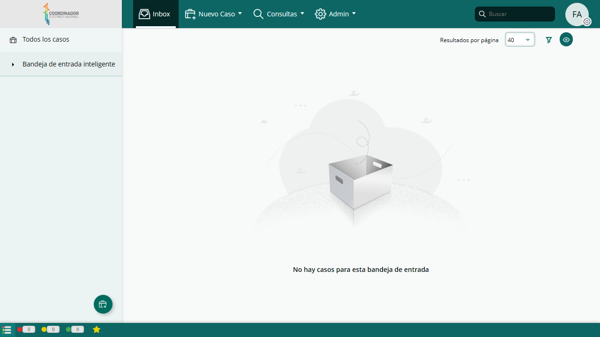
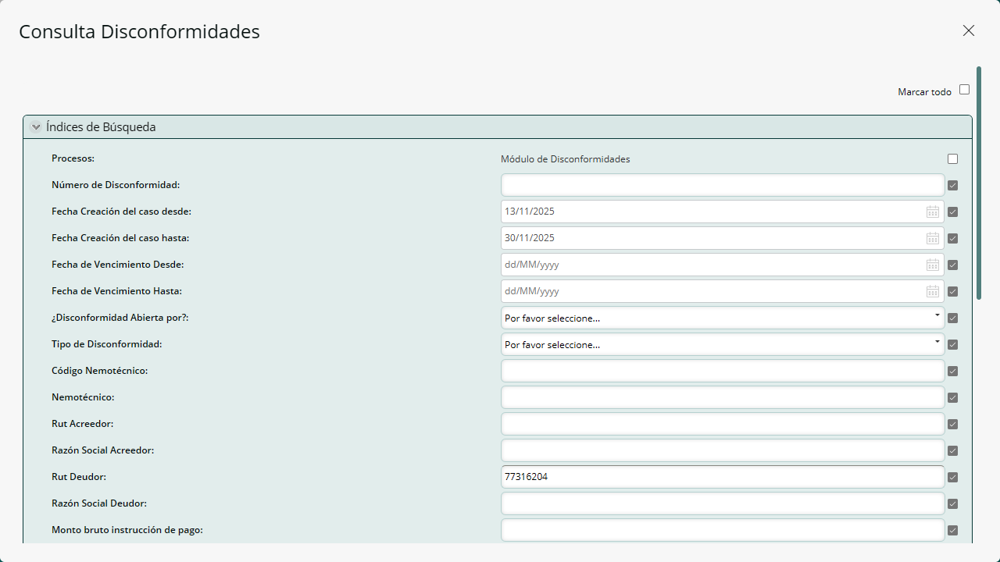
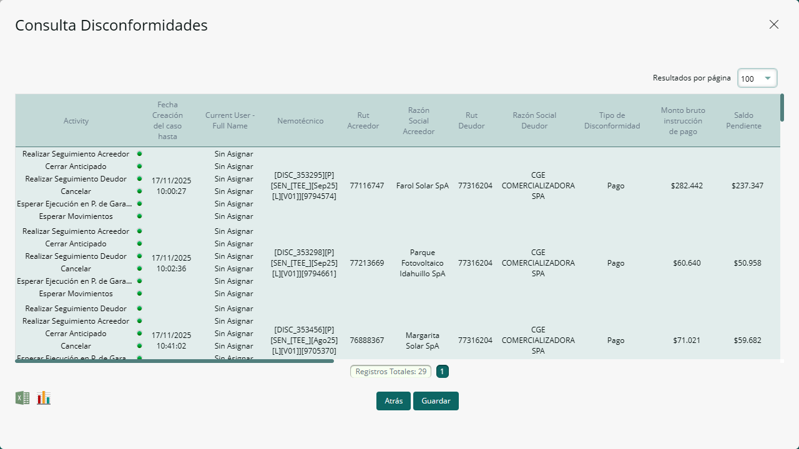

# Agente de Automatización - Portal de Garantías

Este proyecto automatiza la descarga de reportes de "Disconformidades" desde el portal digital del Coordinador Eléctrico Nacional.

## Características

- **Login Automático**: Ingresa credenciales automáticamente.
- **Búsqueda Dinámica**: Calcula fechas (últimos 14 días hasta fin de mes).
- **Descarga Automática**: Guarda el Excel en la carpeta `output/`.
- **Evidencia Visual**: Toma capturas de pantalla del proceso en `docs/screenshots/`.

## Estructura del Proyecto

```text
Disconformidades/
├── app/
│   ├── main.py       # Punto de entrada
│   ├── bot.py        # Lógica del robot
# Agente de Automatización - Portal de Garantías

Este proyecto automatiza la descarga de reportes de "Disconformidades" desde el portal digital del Coordinador Eléctrico Nacional.

## Características

- **Login Automático**: Ingresa credenciales automáticamente.
- **Búsqueda Dinámica**: Calcula fechas (últimos 14 días hasta fin de mes).
- **Descarga Automática**: Guarda el Excel en la carpeta `output/`.
- **Evidencia Visual**: Toma capturas de pantalla del proceso en `docs/screenshots/`.

## Estructura del Proyecto

```text
Disconformidades/
├── app/
│   ├── main.py       # Punto de entrada
│   ├── bot.py        # Lógica del robot
│   └── config.py     # Configuración
├── output/           # Archivos descargados
├── docs/             # Documentación y capturas
└── config.toml       # Archivo de configuración (usuario/clave)
```

## Cómo Ejecutar

1. Asegúrate de tener las dependencias instaladas.
2. Ejecuta el siguiente comando:

```powershell
uv run python -m app.main
```

## Flujo del Proceso

### 1. Inicio de Sesión

El bot navega al portal e ingresa las credenciales.




### 2. Navegación

Ya ingresaste, ahora realiza la navegación.
Accede al menú "Consultas" -> "Consulta Disconformidades".
Rellena el formulario con el rango de fechas calculado y el RUT del deudor.
Luego navega hacia abajo, y apreta el boton para aceptar.


### 4. Descarga

Presiona el botón de exportar y guarda el archivo en la carpeta `output`.

